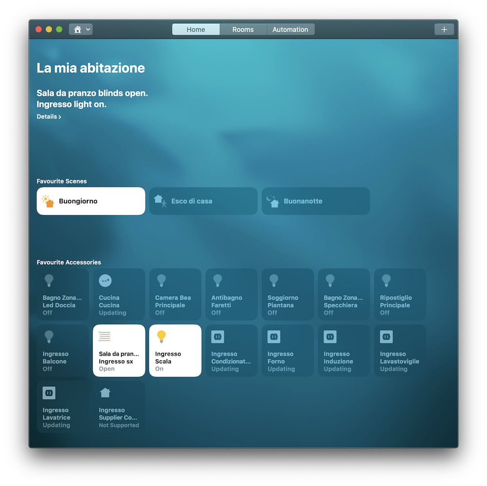

# Comelit HUB integration for Homebridge

This is an Homebridge platform plugin to expose Comelit Home Automation to Apple HomeKit and use it with Siri.
The code is based on the reverse engineering of the official protocol, so expect bugs.

Currently supported devices:

- Simple lights
- Blinds
- Thermostats
- Humidifiers/Dehumidifiers
- Controlled plugs

Missing devices:

- RGB lights
- Dimmerable lights
- Irrigation
- Vedo/VIP

## Configuration

To configure Comelit platform you need to provide some information in the configuration.
Add the following section to the platform array in the Homebridge config.json file:

```json
{
    "platform": "Comelit",
    "name": "My Home",
    "username": "YOUR_USERNAME",
    "password": "YOUR_PASSWORD",
    "broker_url": "mqtt://192.168.1.2"
}
```

By default username and password are both set to `admin`.
`broker_url` is the `mqtt://` + the IP/name of your HUB in the local network.

## Screenshots

